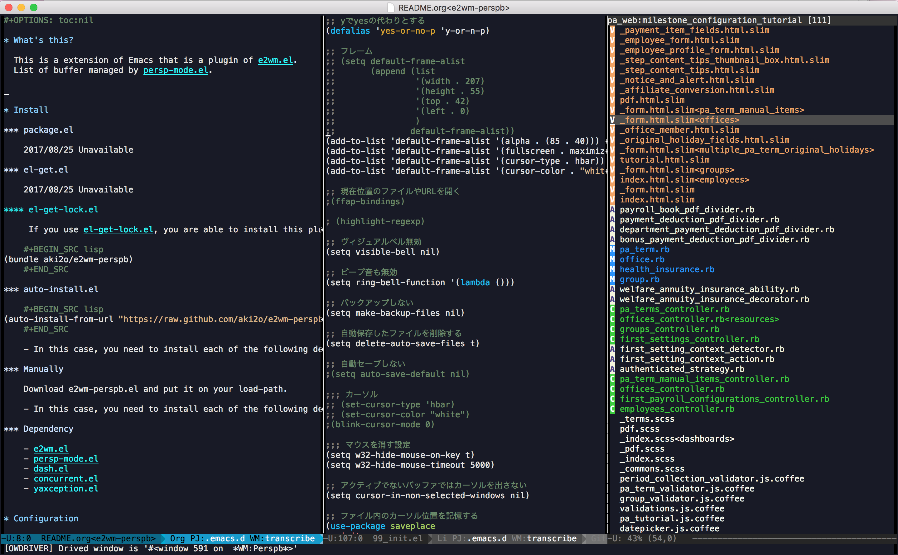

# What's this?

This is a extension of Emacs that is a plugin of [e2wm.el](https://github.com/kiwanami/emacs-window-manager).  
List of buffer managed by [persp-mode.el](https://github.com/Bad-ptr/persp-mode.el).  




# Install


### package.el

2017/08/25 Unavailable


### el-get.el

2017/08/25 Unavailable

If you use [el-get-lock.el](https://github.com/tarao/el-get-lock), you are able to install this plugin by the following code.  

```lisp
    (bundle aki2o/e2wm-perspb)
```


### auto-install.el

```lisp
    (auto-install-from-url "https://raw.github.com/aki2o/e2wm-perspb/master/e2wm-perspb.el")
```

-   In this case, you need to install each of the following dependency.


### Manually

Download e2wm-perspb.el and put it on your load-path.  

-   In this case, you need to install each of the following dependency.


### Dependency

-   [e2wm.el](https://github.com/kiwanami/emacs-window-manager)
-   [persp-mode.el](https://github.com/Bad-ptr/persp-mode.el)
-   [dash.el](https://github.com/magnars/dash.el)
-   [concurrent.el](https://github.com/kiwanami/emacs-deferred)
-   [yaxception.el](https://github.com/aki2o/yaxception)


# Configuration

```lisp
  (require 'e2wm-perspb)

  ;; font-lock in rails project
  (require 'e2wm-perspb-rails)

  (setq e2wm:c-code-recipe
        '(| (:left-max-size 40)
            (- (:upper-size-ratio 0.6)
               files history)
            (- (:lower-max-size 150)
               (| (:right-max-size 40)
                  main imenu)
               sub)))

  (setq e2wm:c-code-winfo
        '((:name main)
          (:name files   :plugin files)
          (:name history :plugin perspb)
          (:name imenu   :plugin imenu :default-hide nil)
          (:name sub     :buffer "*info*" :default-hide t)))

  (e2wm:add-keymap
   e2wm:dp-two-minor-mode-map
   '(("C-." . e2wm-perspb:switch-to-down-entry-command)
     ("C-," . e2wm-perspb:switch-to-up-entry-command)
     ) e2wm:prefix-key)
```


# Tested On

-   Emacs &#x2026; GNU Emacs 24.5.1 (x86<sub>64</sub>-apple-darwin14.5.0, NS apple-appkit-1348.17) of 2016-06-16 on 192.168.102.190
-   e2wm.el &#x2026; 1.2
-   persp-mode.el &#x2026; 2.9.4
-   dash.el &#x2026; 2.12.0
-   concurrent.el &#x2026; 0.3.1
-   yaxception.el &#x2026; 0.3.2

**Enjoy!!!**

